# Electro Pi Task Manager

A modern Task Manager application built with Flutter using **MVVM Architecture**, **BLoC**, and **Firebase**. The app enables users to authenticate securely, manage projects, organize tasks, and track progress with a clean and responsive user interface.


## 📌 Notes

- This project uses **Firebase** as the backend (Authentication + Cloud Firestore).
- You can try the application using the following demo account:

**Email**
```text
ayaabdelmon@gmail.com
```

**Password**
```text
Ayhb756@
```
## 📦 APK

You can download and try the latest APK from the link below: 👉 **[Download APK](https://github.com/<your-username>/<your-repository>/releases/latest/download/app-release.apk)**

> Or download it from the **Releases** section of this repository.

# 📱 Screenshots
## 🚀 Welcome

| Light | Dark |
|:------:|:----:|
| 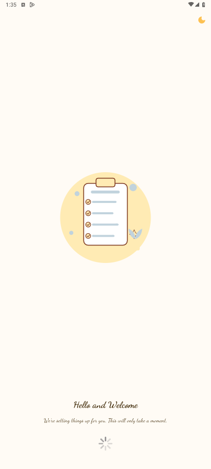 | 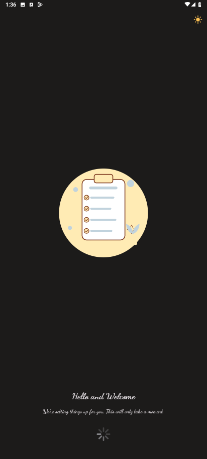 |

---

## 🔐 Authentication

| Login (Light) | Login (Dark) | Register (Light) | Register (Dark) |
|:-------------:|:------------:|:----------------:|:---------------:|
| 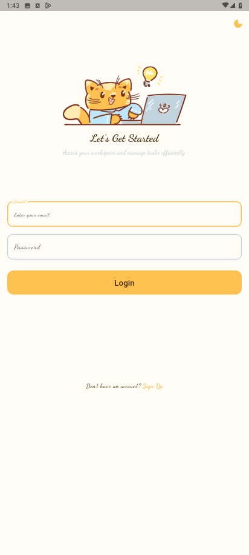 | 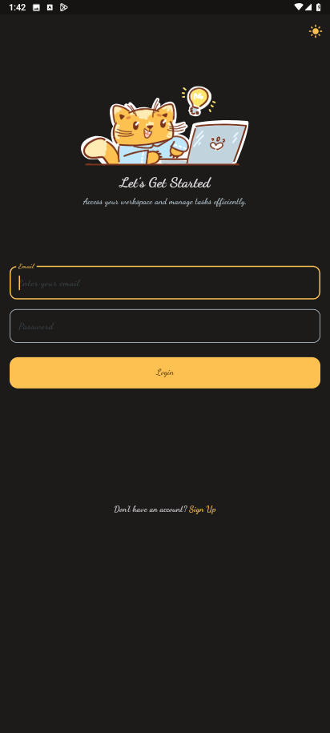 | 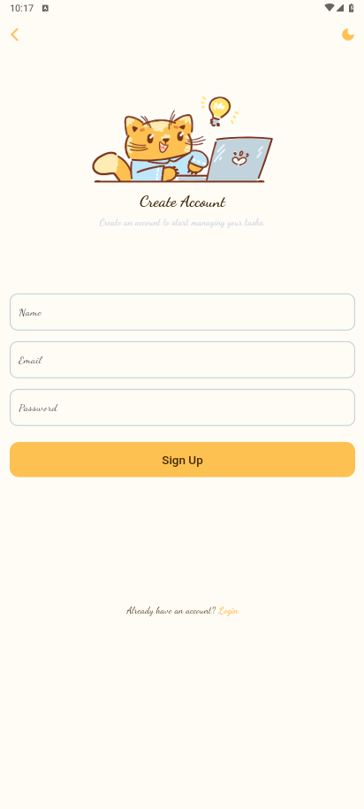 | 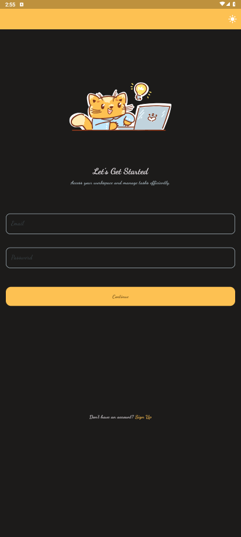 |

---

## 📂 Projects

| Projects (Light) | Projects (Dark) | Search Projects | No Projects |
|:----------------:|:---------------:|:---------------:|:-----------:|
|  | 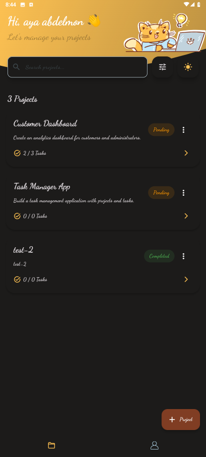 | 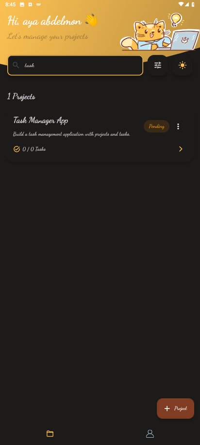 | 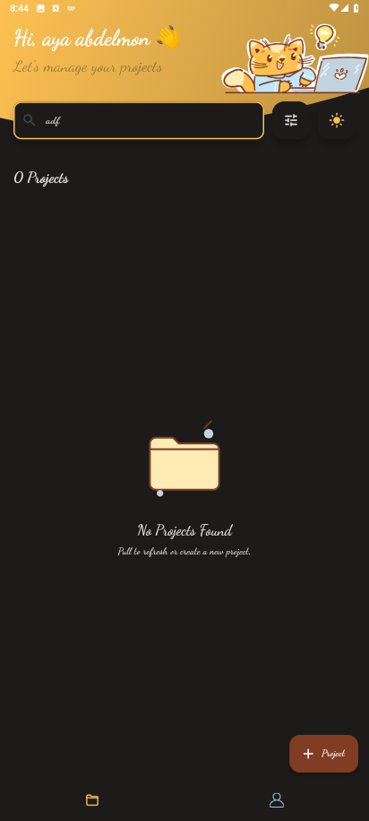 |

---

## ✅ Tasks

| Tasks | Empty Tasks |
|:-----:|:-----------:|
| 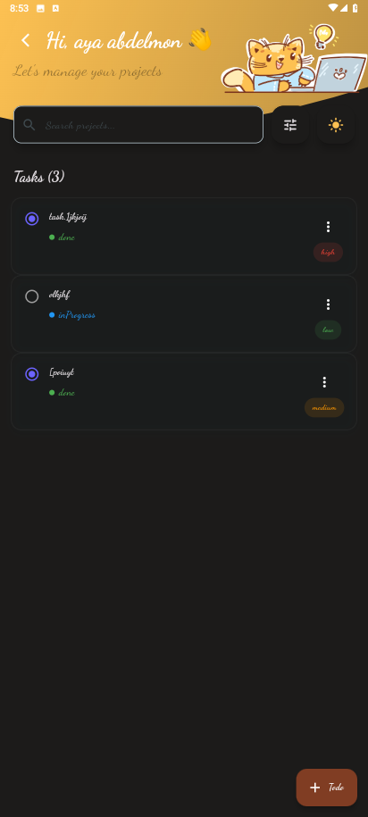 | 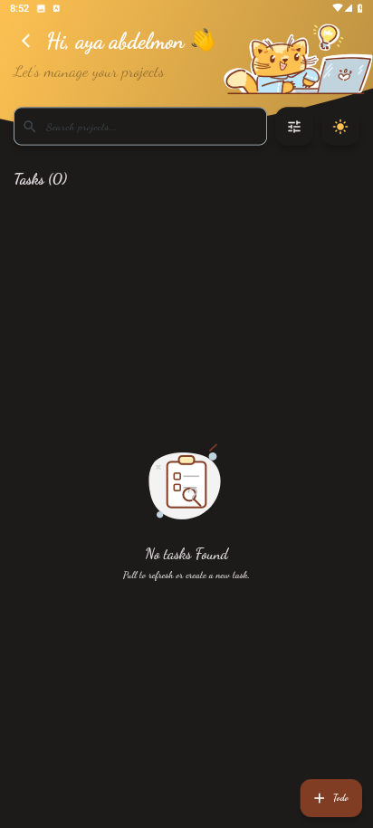 |

---

## ➕ Create

| Add Project | Add Task |
|:-----------:|:--------:|
| 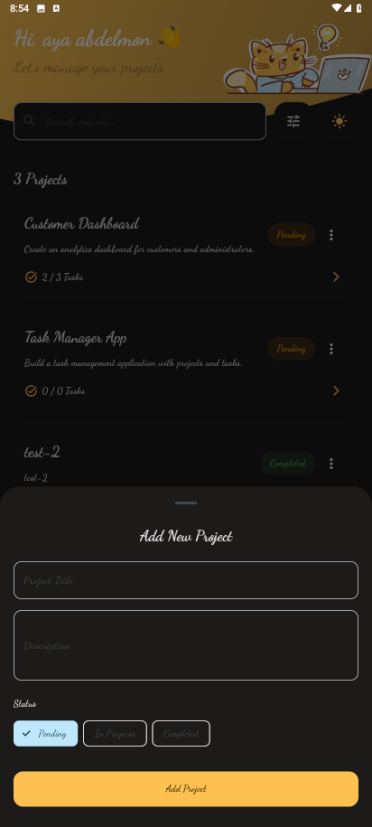 | 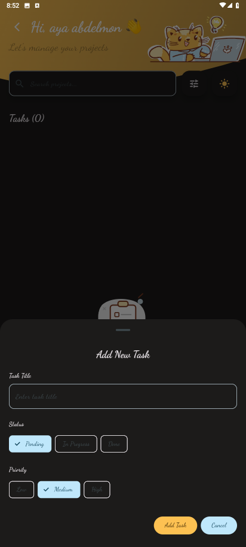 |

---

## ✏️ Edit

| Edit Project | Edit Task |
|:------------:|:---------:|
|  | 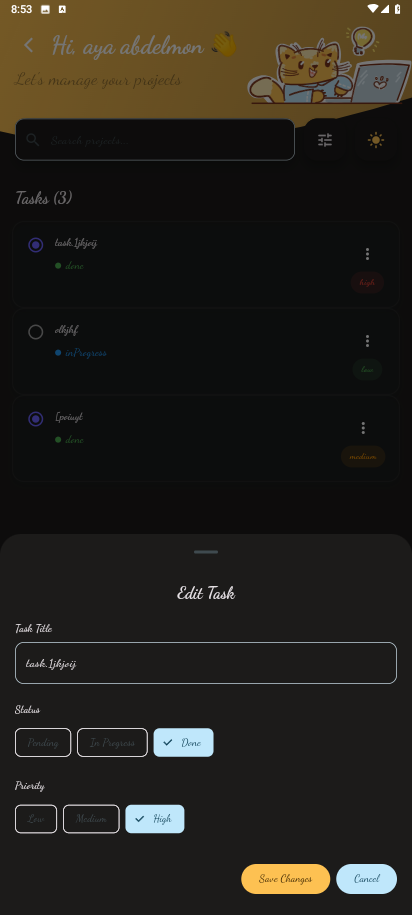 |

---

## 🗑️ Delete

| Delete Project | Delete Task |
|:--------------:|:-----------:|
| 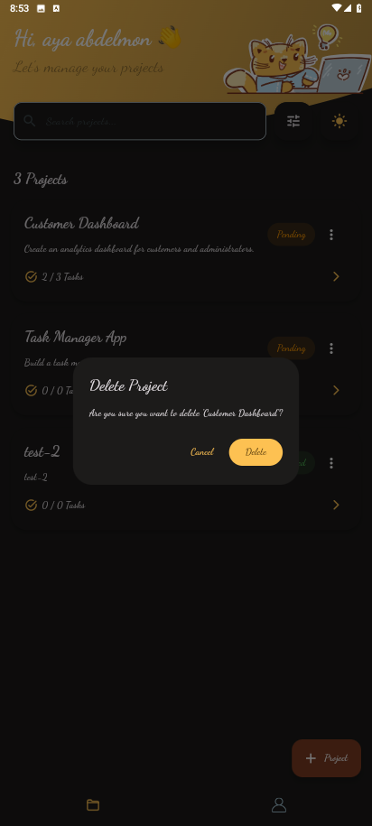 | 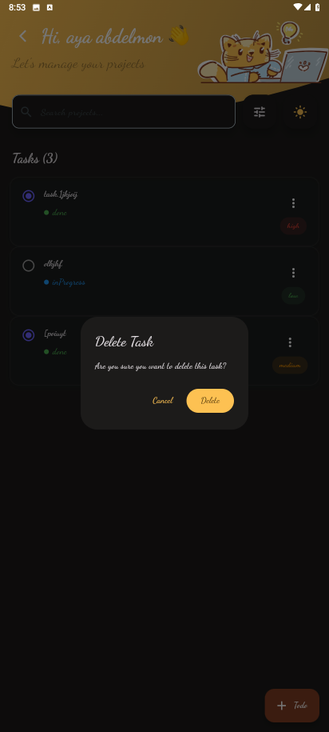 |

---

## 👤 Profile

| Profile | Logout |
|:-------:|:------:|
| 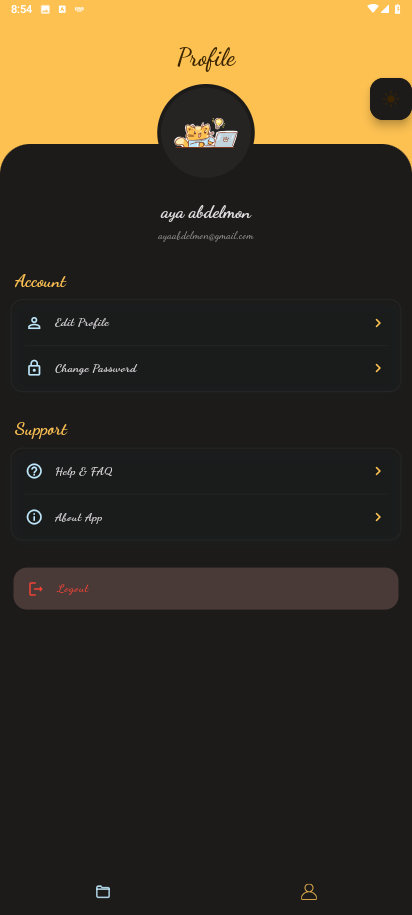 | 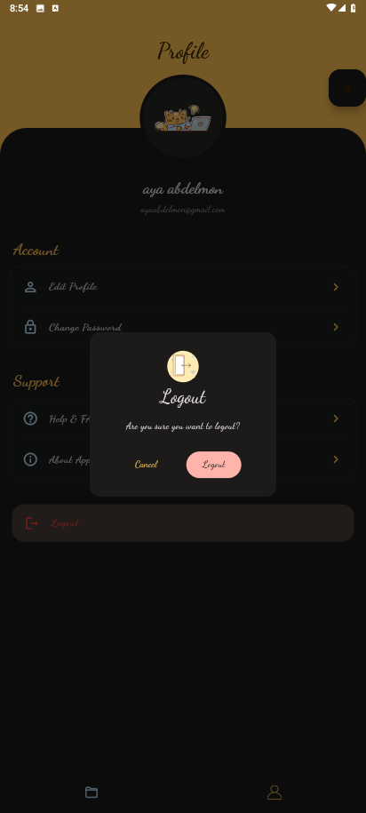 |

---

## ⚠️ Error & Maintenance

| 404 (Light) | 404 (Dark) |
|:-----------:|:----------:|
| 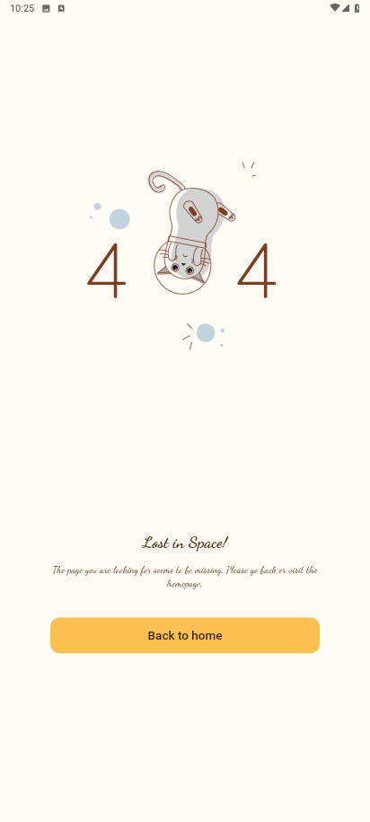 | 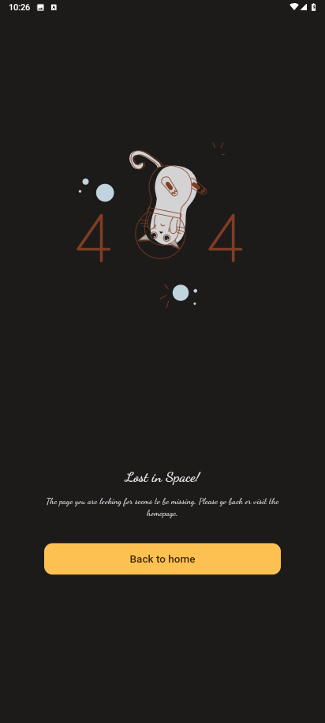 |

<br>

| Under Maintenance 1 | Under Maintenance 2 |
|:-------------------:|:-------------------:|
| 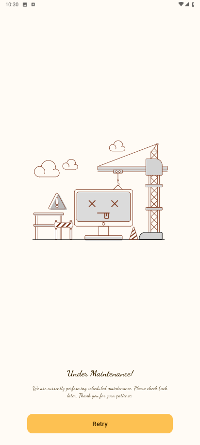 | 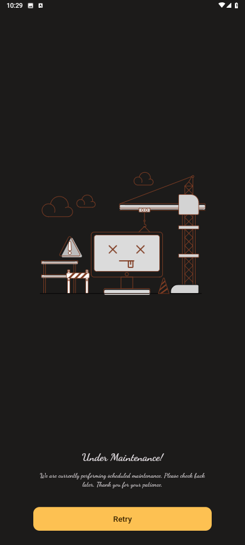 |

---
## ✨ Features

### 🔐 Authentication

* Login with email & password
* User registration
* Persistent authentication
* Auto-login on app launch
* Secure logout

### 📁 Project Management

* View all projects
* Create new projects
* Edit project information
* Delete projects
* Pull-to-refresh
* Empty state support

### ✅ Task Management

* View project tasks
* Add new tasks
* Edit existing tasks
* Delete tasks
* Mark tasks as completed
* Task priorities (Low, Medium, High)
* Task statuses (Pending, In Progress, Done)

### 👤 Profile

* Display current user information
* Dark/Light mode support
* Logout functionality

## 🏗 Architecture

The project follows **MVVM** with clear separation between:

```
lib/
│
├── core/
│   ├── api/
│   ├── common/
│   │   ├── cubits/
│   │   ├── screens/
│   │   └── widgets/
│   ├── constants/
│   ├── error/
│   ├── routing/
│   ├── services/
│   ├── theme/
│   └── utils/
│
├── features/
│   │
│   ├── auth/
│   │   ├── data/
│   │   │   ├── models/
│   │   │   ├── repos/
│   │   │   └── sources/
│   │   └── presentation/
│   │       ├── controllers/
│   │       ├── screens/
│   │       └── widgets/
│   │
│   ├── projects/
│   │   ├── data/
│   │   │   ├── models/
│   │   │   ├── repos/
│   │   │   └── sources/
│   │   └── presentation/
│   │       ├── controllers/
│   │       ├── screens/
│   │       └── widgets/
│
├── firebase_options.dart
└── main.dart
```


## 🛠 Tech Stack

* Flutter
* Dart
* BLoC (flutter_bloc)
* Firebase Authentication
* Cloud Firestore
* GetIt (Dependency Injection)
* SharedPreferences
* Flutter SVG

## 🎯 Implemented Requirements

* ✅ MVVM Architecture
* ✅ Dependency Injection
* ✅ Firebase Authentication
* ✅ Cloud Firestore Database
* ✅ CRUD Operations
* ✅ State Management with BLoC
* ✅ Responsive UI
* ✅ Dark Mode
* ✅ Bottom Sheets
* ✅ Loading States
* ✅ Error Handling
* ✅ Success SnackBars
* ✅ Pull-to-Refresh
* ✅ Named Navigation

## 📱 Screens

* Welcome Screen
* Login
* Register
* Projects
* Project Details
* Add/Edit Project
* Add/Edit Task
* Profile

## 🚀 Getting Started

1. Clone the repository.
2. Run:

```bash
flutter pub get
```

3. Configure Firebase:

* Android (`google-services.json`)
* iOS (`GoogleService-Info.plist`)

4. Run:

```bash
flutter run
```

## 📌 Notes
